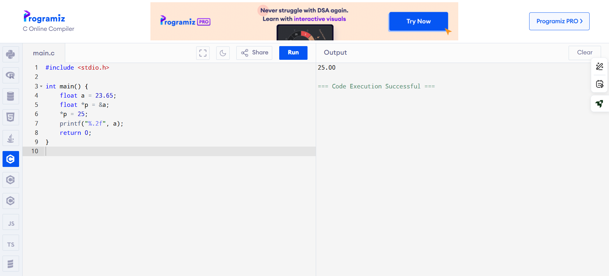
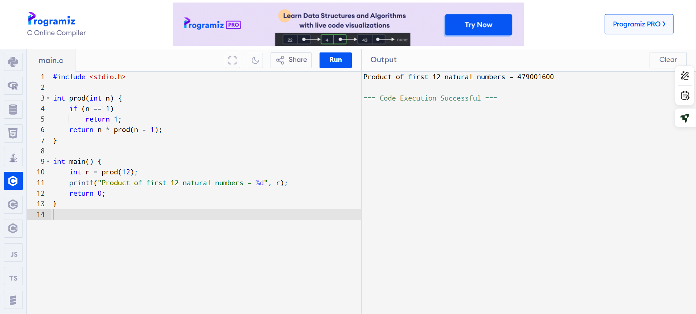
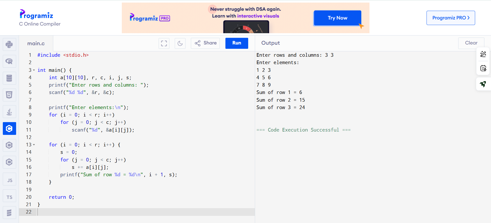
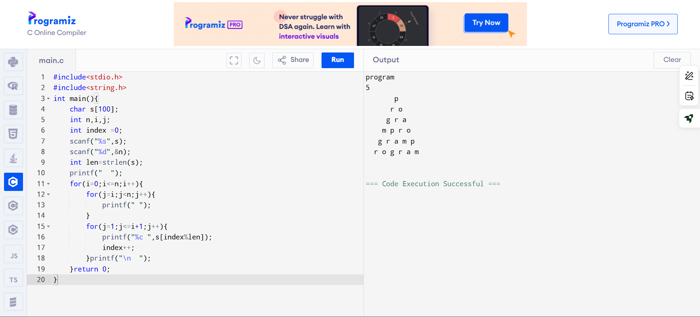
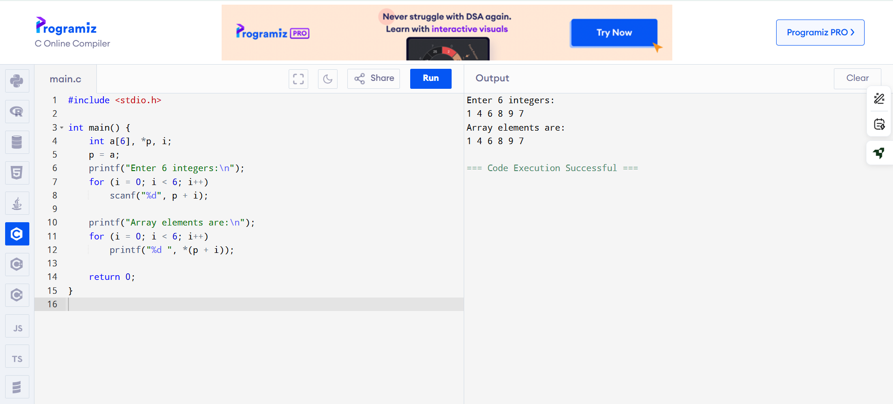

EX-21-POINTERS
# AIM:
Write a C program to convert a 23.65 into 25 using pointer

## ALGORITHM:
1.	Declare a double variable to hold the floating-point number (23.65).
2.	Declare a pointer to double to point to the address of the variable.
3.	Use the pointer to modify the value to 25.0.
4.	Print the modified value.

## PROGRAM:
```
#include <stdio.h>

int main() {
    float a = 23.65;
    float *p = &a;
    *p = 25;
    printf("%.2f", a);
    return 0;
}
```

## OUTPUT:
 	





## RESULT:
Thus the program to convert a 23.65 into 25 using pointer has been executed successfully.
 
 


# EX-22-FUNCTIONS AND STORAGE CLASS

## AIM:

Write a C program to calculate the Product of first 12 natural numbers using Recursion

## ALGORITHM:

1.	Define a recursive function calculateProduct that takes an integer parameter n.
2.	Return n multiplied by the result of the calculateProduct function called with n - 1.
3.	Declare an integer variable n and an unsigned long long variable product.
4.	Initialize n with the value 12 (for the first 12 natural numbers).
5.	Call the calculateProduct function with n and store the result in the product variable.
6.	Print the result, indicating it is the product of the first 12 natural numbers.

## PROGRAM:
```
#include <stdio.h>

int prod(int n) {
    if (n == 1)
        return 1;
    return n * prod(n - 1);
}

int main() {
    int r = prod(12);
    printf("Product of first 12 natural numbers = %d", r);
    return 0;
}
```
## OUTPUT:


         		
## RESULT:

Thus the program has been executed successfully.
 
 


# EX-23-ARRAYS AND ITS OPERATIONS

## AIM:

Write C Program to find Sum of each row of a Matrix

## ALGORITHM:

1.	Declare and initialize the matrix with the desired values.
2.	Create a loop to iterate through each row of the matrix.
3.	Inside the loop, calculate the sum of the elements in each row.
4.	Print the sum for each row.

## PROGRAM:
```
#include <stdio.h>

int main() {
    int a[10][10], r, c, i, j, s;
    printf("Enter rows and columns: ");
    scanf("%d %d", &r, &c);

    printf("Enter elements:\n");     
    for (i = 0; i < r; i++)
        for (j = 0; j < c; j++)
            scanf("%d", &a[i][j]);

    for (i = 0; i < r; i++) {
        s = 0;
        for (j = 0; j < c; j++)
            s += a[i][j];
        printf("Sum of row %d = %d\n", i + 1, s);
    }

    return 0;
}
```


## OUTPUT


 
 

 ## RESULT
 


# EX-24-STRINGS

## AIM:

Write C program for the below pyramid string pattern. Enter a string: PROGRAM Enter number of rows: 5 P R O G R A M P R O G R A M P R O G R A M

## ALGORITHM:

1.	Input the number of rows for the pyramid (e.g., num_rows).
2.	Initialize variables:i for the row count (starting from 1),j for the character count (starting from 1)
3.	Start a loop for i from 1 to num_rows (for each row of the pyramid).
4.	Calculate the midpoint position as midpoint = (2 * num_rows - 1) / 2.
5.	End the program.

## PROGRAM:
```
#include<stdio.h>
#include<string.h>
int main(){
    char s[100];
    int n,i,j;
    int index =0;
    scanf("%s",s);
    scanf("%d",&n);
    int len=strlen(s);
    printf("  ");
    for(i=0;i<=n;i++){
        for(j=i;j<n;j++){
            printf(" ");
        }
        for(j=1;j<=i+1;j++){
            printf("%c ",s[index%len]);
            index++;
        }printf("\n  ");
    }return 0;
}
```


 ## OUTPUT

 

## RESULT

Thus the C program to String process executed successfully
 

 


# EX -25 –DISPLAYING ARRAYS USING POINTERS
## AIM

Write a c program to read and display an array of any 6 integer elements using pointer

## ALGORITHM
Step 1: Start the program.
Step 2: Declare the following:
•	Integer variable i for iteration.
•	Integer variable n to store the number of elements.
•	Integer array arr[10] to hold up to 10 elements.
•	Integer pointer parr and initialize it to point to the array arr.
Step 3: Read the value of n (number of elements) from the user.
Step 4: Loop from i = 0 to i < n:
•	Read an integer value and store it in the address parr + i using pointer arithmetic.
Step 5: Loop from i = 0 to i < n:
•	Print the element at *(parr + i) using pointer dereferencing.
Step 6: End the program.

## PROGRAM
```
#include <stdio.h>

int main() {
    int a[6], *p, i;
    p = a;
    printf("Enter 6 integers:\n");
    for (i = 0; i < 6; i++)
        scanf("%d", p + i);

    printf("Array elements are:\n");
    for (i = 0; i < 6; i++)
        printf("%d ", *(p + i));

    return 0;
}
```

## OUTPUT

 

## RESULT

Thus the C program to read and display an array of any 6 integer elements using pointer has been executed


